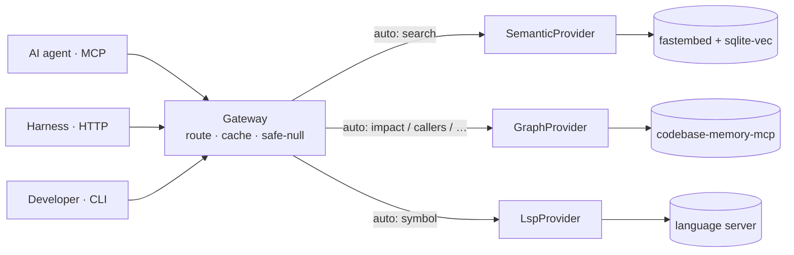

# codeintel

A unified code-intelligence gateway — graph + LSP + semantic — that gives any coding agent a single safe API to search, trace, and understand any codebase.

[](https://github.com/hamilton-sky/codeintel/actions/workflows/ci.yml)

## Quickstart

```bash
pip install codecortex
```

This installs the `codeintel` CLI; the **semantic** engine works out of the box. The **graph**
and **LSP** engines use external backends (`codebase-memory-mcp`, and serena via `uvx`) —
run `codeintel doctor` to see what's available and how to enable the rest. (On PyPI the
distribution is `codecortex` because `codeintel` was taken; the CLI and import stay `codeintel`.)

Or from source:

```bash
git clone https://github.com/hamilton-sky/codeintel.git
cd codeintel
pip install -e .
```

Register with your AI agent(s):

```bash
codeintel install            # registers with Claude, Codex, Gemini, Zed
```

Index a project, check what's ready, and run your first query:

```bash
codeintel index /path/to/your/project
codeintel doctor /path/to/your/project    # which engines are ready + how to fix the rest
codeintel query --op search --target "authentication middleware"
```

## How it works

A `Gateway` receives every query and dispatches it to one of three providers — graph (structural relationships), LSP (precise symbol resolution), or semantic (embedding-based search) — based on the operation type. Each provider is fully isolated: if it is unavailable or raises an exception, the gateway catches it and returns a safe-null envelope. The caller always gets a well-formed response with no exception to catch.



> Full walkthrough: **[docs/architecture.md](docs/architecture.md)** · **[docs/query-flow.md](docs/query-flow.md)**.

## Safe-null contract

Every `Gateway.query()` call returns a dict with exactly these keys:

```json
{"ok": true, "op": "search", "target": "auth", "result": null, "engine": "semantic", "cached": false}
```

`ok` is always `true`. `result` is `null` when no provider has an answer — never an exception, never a 500. An optional `reason` key explains null results (e.g. `"engine-unavailable"`, `"no-result"`). Callers must check `result is not None` before using the value.

## Engines

| Engine | Key ops | Install prereq |
|---|---|---|
| `graph` | `impact`, `callers`, `callees`, `chain`, `pattern`, `overview`, `context` | `codebase-memory-mcp` CLI on PATH — see [docs/graph.md](docs/graph.md) |
| `lsp` | `symbol`, `overview`, `context` | `uvx` on PATH — serena is fetched from GitHub on first use; see [docs/lsp.md](docs/lsp.md) |
| `semantic` | `search`, `context` | `fastembed` + `sqlite-vec` (installed with the package) — see [docs/semantic.md](docs/semantic.md) |

Run `codeintel doctor` at any time to see which engines are actually ready for a repo and how to fix the ones that aren't.

Pass `--engine auto` (the default) and codeintel chooses the best engine per operation. Pass `--engine both` or `--engine all` to fan out to multiple engines and merge results.

## Documentation

Full system docs live in [`docs/`](docs/) — start with the index:

- **[Architecture](docs/architecture.md)** — layers, the `CodeProvider` protocol, the safe-null contract, caching, freshness (ASCII + Mermaid).
- **[Query flow](docs/query-flow.md)** — request lifecycle, engine selection, fan-out & merge, and why it never throws.
- **[Map file](docs/map-file.md)** — the static `CODE_INTEL.md` orientation layer for hosts with no MCP support.
- Engine references: **[graph](docs/graph.md)** · **[lsp](docs/lsp.md)** · **[semantic](docs/semantic.md)**.

## CLI reference

| Command | Purpose |
|---|---|
| `codeintel install [--agent claude\|codex\|gemini\|zed\|all]` | Register codeintel with AI agent(s) |
| `codeintel setup [project_root] [--index] [--warm] [--install-uv]` | Check backends + optionally index this repo; ends with a health report |
| `codeintel index [project_root]` | Index a project for semantic search |
| `codeintel serve` | Start the MCP server (stdio transport) |
| `codeintel serve-http [--host HOST] [--port 8766] [--allow-remote]` | Start the HTTP transport (loopback-only unless `--allow-remote`) |
| `codeintel query --op OP --target TARGET [--engine auto]` | Run a single query and print the result |
| `codeintel status [project_root]` | Show engine availability and index age |
| `codeintel doctor [project_root] [--deep] [--json]` | Diagnose per-engine health + repo index status, with a fix for each gap |
| `codeintel map [project_root]` | Generate the `CODE_INTEL.md` orientation file |
| `codeintel reset [project_root] [--all] [--yes]` | Clear the semantic index (this repo, or `--all`) to recover from a corrupt/stale DB |

Human-facing commands (`doctor`, `status`, `query`, `setup`, `reset`) honor `--no-color` / `NO_COLOR` and `--ascii`, and auto-degrade to plain text when piped.

## Config

Create `.codeintel.toml` at your project root to override defaults:

```toml
backend      = "auto"                   # auto | graph | lsp | semantic
semantic     = "on"                     # on | off
reindex      = "on-demand"              # on-demand | never
cosine_floor = 0.25                     # minimum similarity score for semantic hits
max_chunks   = 500                      # max chunks to embed per project
model        = "BAAI/bge-small-en-v1.5" # fastembed embedding model
```

## Privacy & dependencies

**codeintel is local-first** — one local process, no cloud service, no API keys, no telemetry, and no per-query network. Its own code makes zero outbound HTTP calls, and the HTTP transport binds to `127.0.0.1` only.

**Bundled (installed with the package, run locally):** `mcp` (the tool interface) · `sqlite-vec` (the semantic index, a local DB file) · `fastembed` (the local embedding model).

**Optional external backends** — auto-detected on `PATH`; if one is absent, that engine returns a safe-null and the agent simply degrades to grep:

| Engine | Needs on `PATH` | Third-party? |
|---|---|---|
| `graph` | `codebase-memory-mcp` | yes — external CLI |
| `lsp` | `uvx` (fetches & runs serena from GitHub on first use) | yes — [oraios/serena](https://github.com/oraios/serena) |
| `semantic` | *nothing external* | no — fully in-house |

Not sure what's installed? `codeintel doctor` reports exactly which backends are present, whether this repo is indexed, and the command to fix each gap.

**The only network touch is first-run setup:** `fastembed` downloads the `BAAI/bge-small-en-v1.5` weights once (cached under `~/.cache`, fully offline thereafter); the optional backends also install on first use *if you opt in*. After that, **no code or data leaves your machine** — which is what makes `--engine all` safe to run on a private repo.

## For agents

Start the HTTP server, then POST queries to `/code/query`:

```bash
codeintel serve-http &   # listens on 127.0.0.1:8766 by default
```

```python
import urllib.request, json

def code_query(op: str, target: str, engine: str = "auto") -> dict:
    body = json.dumps({"op": op, "target": target, "engine": engine}).encode()
    req = urllib.request.Request(
        "http://127.0.0.1:8766/code/query",
        data=body,
        headers={"Content-Type": "application/json"},
    )
    with urllib.request.urlopen(req) as resp:
        return json.loads(resp.read())

result = code_query("search", "authentication middleware")
if result["result"] is not None:
    print(result["result"])   # ranked semantic matches
```

The response is always JSON-safe. Check `result["result"] is not None` before use. Never catch an exception from the gateway — it never raises.

## Development

```bash
git clone https://github.com/hamilton-sky/codeintel.git
cd codeintel
pip install -e .[dev]
pytest tests/ -q            # full suite, ~1s
```
