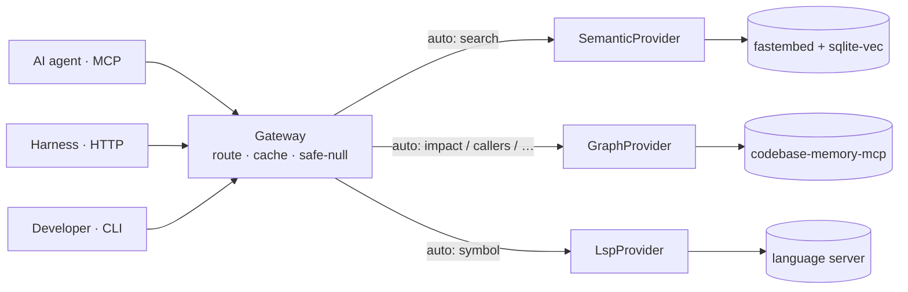

# codeintel

**One MCP tool that lets a coding agent search, trace, and *understand* a codebase — structurally, not by grepping.** codeintel unifies three engines — a call/import **graph**, an **LSP** for exact symbols, and **semantic** embedding search — behind a single `code.query` call that routes to the right engine, caches the answer, and **never throws**. The agent always gets back a clean, well-formed result to reason over.

[](https://github.com/hamilton-sky/codeintel/actions/workflows/ci.yml)


> *codeintel visualizing its own codebase.* One command — `codeintel graph <repo> --html` — turns any indexed repo into a **self-contained, interactive call graph** you can open offline or share as a file. Layouts, complexity-sized nodes, click-to-inspect metrics, and JSON/Markdown/SVG/PNG export. See **[docs/graph-viewer.md](docs/graph-viewer.md)**.

Prefer plain text? `codeintel map` writes a **readable architecture overview** to `CODE_INTEL.md` — node/edge counts, ranked symbols by caller count, and entry points — for skimming or for MCP hosts that can't render a graph:


## Why an agent needs it

Without structural tools, an agent dropped into unfamiliar code falls back on `grep` and reads whole files to reconstruct relationships by hand — burning tokens, missing call sites, and guessing at blast radius before it edits anything. codeintel answers those questions directly instead:

- **"What calls this? What breaks if I change it?"** → the real call graph, which catches cross-file and module-level callers a text search silently misses.
- **"Where is this symbol defined, and everywhere it's used?"** → the language server, with exact locations.
- **"Where's the code that does X?"** (when you don't know the name) → semantic search over the repo.
- **Always a clean answer.** Every call returns the same JSON envelope. A missing or broken backend degrades to a safe `null` *with a reason* — so the agent falls back to grep instead of crashing on an exception it can't reason its way out of.

Net effect: fewer, sharper tool calls, less re-reading, and an agent that can see *structure* — callers, impact, call chains — that plain search can't.

## What your agent can ask

It's one call: `code.query(op, target, engine="auto")`. In `auto` mode (the default) codeintel picks the engine per operation:

| Ask | `op` | Engine (auto) | Comes back as |
|---|---|---|---|
| Find code by meaning ("auth middleware") | `search` | semantic | ranked `path:line │ snippet` hits |
| A symbol's definition **and** all references | `symbol` | lsp | definition body + reference list |
| Who calls this? | `callers` | graph | caller symbols + files |
| What does this call? | `callees` | graph | callee symbols + files |
| Blast radius of a change | `impact` | graph | callers **and** callees together |
| Trace a call chain up/downstream | `chain` | graph | ordered, risk-labeled hops |
| Find symbols by pattern | `pattern` | graph | matching nodes + locations |
| Project shape at a glance | `overview` | graph → lsp | modules, node/edge counts, languages |
| Everything about one symbol | `context` | graph + lsp | both views merged |
| **Impact of your uncommitted edits** | `changed` | graph | changed files → impacted symbols |
| Refactor-risk hotspots | `hotspots` | graph | highest complexity / fan-in symbols |
| Unreferenced (dead) code | `deadcode` | graph | non-test symbols with no callers |

Pin one engine with `--engine graph│lsp│semantic`, or fan out with `--engine both` / `all` to merge results.

**Example — "who uses `safe_null_result`?"**

```jsonc
// request
{ "op": "callers", "target": "safe_null_result", "engine": "auto" }

// response — always this exact envelope; `result` is ready-to-read markdown
{
  "ok": true, "op": "callers", "target": "safe_null_result",
  "engine": "graph", "cached": false,
  "result": "## Callers of safe_null_result (7)\n- …gateway [USAGE] (src/codeintel/gateway.py)\n- …providers.graph [USAGE] (src/codeintel/providers/graph.py)\n- …server [USAGE] (src/codeintel/server.py)\n- … (4 more)"
}
```

The agent hands `result` straight to the model. If the graph backend isn't installed, the identical call returns `"result": null, "reason": "engine-unavailable"` — no exception, and the agent just falls back to its own search.

## What makes it good

- **Local-first and private.** One process on your machine — no cloud service, no API keys, no telemetry, no per-query network. Safe to point at a private repo, even with `--engine all`. (The one-time exception: `fastembed` downloads its embedding model once, then runs fully offline.)
- **It never throws.** Every call returns the same JSON envelope; a missing or broken backend degrades to `null` *with a reason*. No exceptions, no 500s, no malformed output for the agent to trip over — so you never wrap `code.query` in a `try`.
- **One tool, not three.** Register a single MCP server and it auto-routes each question to graph, LSP, or semantic — instead of wiring up three backends with three response shapes and three failure modes.
- **Degrades instead of breaking.** No graph backend installed? That engine returns `null` and the agent falls back to grep. The semantic engine needs nothing external, so codeintel is useful the moment it's installed and only gets sharper as you add backends.
- **Fast on repeat, never stale.** A content-hash cache returns instantly for unchanged code and self-invalidates when a background reindex advances the index — answers stay both quick *and* fresh. The cache is bounded (LRU), so a long-running server holds steady memory.
- **Concurrency-safe.** The HTTP transport handles requests on threads, so one slow query (an LSP session warming, a first-time index) can't block every other agent.
- **Honest about its own health.** `codeintel doctor` reports exactly which engines are ready for a repo and the single command to fix each gap — no guessing why a query came back empty.

## Quickstart

```bash
pip install codecortex
```

This installs the `codeintel` CLI; the **semantic** engine works out of the box. (On PyPI the
distribution is `codecortex` because `codeintel` was taken; the CLI and import stay `codeintel`.)

**One command prepares the rest and indexes your repo:**

```bash
codeintel setup --all /path/to/your/project
```

This installs `uv` (for the LSP engine), warms serena, downloads the embedding model, indexes the
repo, and prints a health report ending in a **Next:** list — exactly what's ready and the one
remaining step. It's idempotent, so re-running is safe. The **graph** engine (`codebase-memory-mcp`)
is an *optional* external binary that adds who-calls / impact / hotspots / `changed`; codeintel is
fully usable without it.

Or from source:

```bash
git clone https://github.com/hamilton-sky/codeintel.git
cd codeintel
pip install -e .
```

Register with your AI agent(s), then query:

```bash
codeintel install            # registers with Claude, Codex, Gemini, Zed
codeintel query --op search --target "authentication middleware"
```

## How it works

A `Gateway` receives every query and dispatches it to one of three providers — graph (structural relationships), LSP (precise symbol resolution), or semantic (embedding-based search) — based on the operation type. Each provider is fully isolated: if it is unavailable or raises an exception, the gateway catches it and returns a safe-null envelope. The caller always gets a well-formed response with no exception to catch.



> Full walkthrough: **[docs/architecture.md](docs/architecture.md)** · **[docs/query-flow.md](docs/query-flow.md)**.

## Safe-null contract

Every `Gateway.query()` call returns a dict with exactly these keys:

```json
{"ok": true, "op": "search", "target": "auth", "result": null, "engine": "semantic", "cached": false}
```

`ok` is always `true`. `result` is `null` when no provider has an answer — never an exception, never a 500. An optional `reason` key explains null results (e.g. `"engine-unavailable"`, `"no-result"`). Callers must check `result is not None` before using the value.

## Engines

| Engine | Key ops | Install prereq |
|---|---|---|
| `graph` | `impact`, `callers`, `callees`, `chain`, `pattern`, `overview`, `context` | `codebase-memory-mcp` CLI on PATH — see [docs/graph.md](docs/graph.md) |
| `lsp` | `symbol`, `overview`, `context` | `uvx` on PATH — serena is fetched from GitHub on first use; see [docs/lsp.md](docs/lsp.md) |
| `semantic` | `search`, `context` | `fastembed` + `sqlite-vec` (installed with the package) — see [docs/semantic.md](docs/semantic.md) |

Run `codeintel doctor` at any time to see which engines are actually ready for a repo and how to fix the ones that aren't.

Pass `--engine auto` (the default) and codeintel chooses the best engine per operation. Pass `--engine both` or `--engine all` to fan out to multiple engines and merge results.

## Documentation

Full system docs live in [`docs/`](docs/) — start with the index:

- **[Architecture](docs/architecture.md)** — layers, the `CodeProvider` protocol, the safe-null contract, caching, freshness (ASCII + Mermaid).
- **[Query flow](docs/query-flow.md)** — request lifecycle, engine selection, fan-out & merge, and why it never throws.
- **[Map file](docs/map-file.md)** — the static `CODE_INTEL.md` orientation layer for hosts with no MCP support.
- **[Benchmarks](docs/benchmarks.md)** — real numbers at scale: 25 k chunks indexed in ~8 min, ~235 ms warm queries, 60 MB index.
- Engine references: **[graph](docs/graph.md)** · **[lsp](docs/lsp.md)** · **[semantic](docs/semantic.md)**.

## CLI reference

| Command | Purpose |
|---|---|
| `codeintel install [--agent claude\|codex\|gemini\|zed\|all]` | Register codeintel with AI agent(s) |
| `codeintel setup [project_root] [--all] [--index] [--warm] [--install-uv] [--install-deps] [--json]` | Prepare backends + index this repo (`--all` = one command: do everything automatable, idempotent); ends with a health report + **Next:** steps |
| `codeintel index [project_root]` | Index a project for semantic search |
| `codeintel serve` | Start the MCP server (stdio transport) |
| `codeintel serve-http [--host HOST] [--port 8766] [--allow-remote] [--token TOKEN]` | Start the HTTP transport (loopback-only unless `--allow-remote`; `--token` requires a bearer token on every request) |
| `codeintel query --op OP --target TARGET [--engine auto]` | Run a single query and print the result |
| `codeintel status [project_root]` | Show engine availability and index age |
| `codeintel doctor [project_root] [--deep] [--json]` | Diagnose per-engine health + repo index status, with a fix for each gap |
| `codeintel map [project_root]` | Generate the `CODE_INTEL.md` orientation file |
| `codeintel graph [project_root] [--html] [--out FILE] [--limit N]` | Emit the call graph as `{nodes,edges}` JSON, or `--html` a self-contained interactive viewer — see [docs/graph-viewer.md](docs/graph-viewer.md) |
| `codeintel reset [project_root] [--all] [--yes]` | Clear the semantic index (this repo, or `--all`) to recover from a corrupt/stale DB |
| `codeintel gen-token` | Print a secure random bearer token (for `serve-http` / RBAC `auth.toml`) |

Human-facing commands (`doctor`, `status`, `query`, `setup`, `reset`) honor `--no-color` / `NO_COLOR` and `--ascii`, and auto-degrade to plain text when piped.

## Config

Create `.codeintel.toml` at your project root to override defaults:

```toml
backend          = "auto"                   # auto | graph | lsp | semantic
semantic         = "on"                     # on | off
reindex          = "on-demand"              # on-demand | never
cosine_floor     = 0.25                     # minimum similarity score for semantic hits (0–1)
max_chunks       = 500                      # max chunks to embed per file
max_total_chunks = 100000                   # safety ceiling on chunks embedded in one index pass
model            = "BAAI/bge-small-en-v1.5" # fastembed embedding model
```

Config is **validated on load** — an out-of-range number, a misspelled enum, or a wrong type falls back to that key's default (with a logged warning) instead of breaking every query.

**Environment variables:**

| Variable | Effect |
|---|---|
| `CODEINTEL_HTTP_TOKEN` | Bearer token required by `serve-http` (equivalent to `--token`) |
| `CODEINTEL_AUTH_CONFIG` | Path to an RBAC token→role config (default `~/.codeintel/auth.toml`) — per-token roles + op scopes |
| `CODEINTEL_LOG_LEVEL` | `DEBUG`\|`INFO`\|`WARNING`(default)\|`ERROR` for the server logger |
| `CODEINTEL_LOG_FORMAT=json` | Structured (JSON-per-line) logs for ELK / Splunk / Datadog |
| `CODEINTEL_HTTP_ACCESS_LOG=1` | One log line per HTTP request (method, path, status, latency) |
| `CODEINTEL_DEBUG=1` | Log the full traceback of any error the never-throw contract swallows (silent by default) — the switch for diagnosing an unexpected `null` |
| `CODEINTEL_REINDEX=off` | Disable the background reindexer; queries then index inline to stay fresh |

## Privacy & dependencies

**codeintel is local-first** — one local process, no cloud service, no API keys, no telemetry, and no per-query network. Its own code makes zero outbound HTTP calls, and the HTTP transport binds to `127.0.0.1` only by default — binding a non-loopback host requires `--allow-remote`, and `--token` (or `CODEINTEL_HTTP_TOKEN`) then gates every request behind a bearer token. The server bounds concurrent connections, but for exposure to a hostile network you should still front it with a reverse proxy (TLS, rate-limiting) — the built-in `http.server` is not hardened for the open internet.

**Bundled (installed with the package, run locally):** `mcp` (the tool interface) · `sqlite-vec` (the semantic index, a local DB file) · `fastembed` (the local embedding model).

**Optional external backends** — auto-detected on `PATH`; if one is absent, that engine returns a safe-null and the agent simply degrades to grep:

| Engine | Needs on `PATH` | Third-party? |
|---|---|---|
| `graph` | `codebase-memory-mcp` | yes — external CLI |
| `lsp` | `uvx` (fetches & runs serena from GitHub on first use) | yes — [oraios/serena](https://github.com/oraios/serena) |
| `semantic` | *nothing external* | no — fully in-house |

Not sure what's installed? `codeintel doctor` reports exactly which backends are present, whether this repo is indexed, and the command to fix each gap.

**The only network touch is first-run setup:** `fastembed` downloads the `BAAI/bge-small-en-v1.5` weights once (cached under `~/.cache`, fully offline thereafter); the optional backends also install on first use *if you opt in*. After that, **no code or data leaves your machine** — which is what makes `--engine all` safe to run on a private repo.

## For agents

Register codeintel as an MCP server (`codeintel install`) and the agent gets four tools:

| MCP tool | HTTP equivalent | Purpose |
|---|---|---|
| `code.query` | `POST /code/query` | The main call — search, trace, understand (the `op` table above) |
| `code.status` | `GET /code/status` | Which engines are live + whether an index exists |
| `code.doctor` | `POST /code/doctor` | Per-engine health + repo index status, with a fix for each gap |
| `code.map` | — | Generate/refresh `CODE_INTEL.md`, a static orientation file for hosts without MCP |

Over MCP the agent calls `code.query` directly. Over HTTP, start the server and POST to `/code/query`:

```bash
codeintel serve-http &   # listens on 127.0.0.1:8766 by default
```

For a shared or remote deployment, start it with `--allow-remote --token "$CODEINTEL_HTTP_TOKEN"` and send `Authorization: Bearer <token>` on each request — a missing or wrong token gets a clean `401`. Requests are handled concurrently, so one slow query never blocks another.

```python
import urllib.request, json

def code_query(op: str, target: str, engine: str = "auto") -> dict:
    body = json.dumps({"op": op, "target": target, "engine": engine}).encode()
    req = urllib.request.Request(
        "http://127.0.0.1:8766/code/query",
        data=body,
        headers={"Content-Type": "application/json"},
    )
    with urllib.request.urlopen(req) as resp:
        return json.loads(resp.read())

result = code_query("search", "authentication middleware")
if result["result"] is not None:
    print(result["result"])   # ranked semantic matches
```

The response is always JSON-safe. Check `result["result"] is not None` before use. Never catch an exception from the gateway — it never raises.

## Operations & deployment

Running codeintel as a shared service? It ships with what ops teams expect:

| Endpoint | Auth | Purpose |
|---|---|---|
| `GET /healthz` | none | Liveness — always `200` (for load balancers / `livenessProbe`) |
| `GET /readyz` | none | Readiness — `200` once the gateway is up (`readinessProbe`) |
| `GET /metrics` | token | Prometheus exposition — request counts, latency, in-flight, build info |

Plus **bearer-token auth** — or **RBAC** (per-token roles + op scopes via `auth.toml`; a disallowed op returns `403`, and the role is server-authoritative so a client can't escalate) — **structured JSON logs** (`CODEINTEL_LOG_FORMAT=json`) with optional per-request access logs, **graceful `SIGTERM`** shutdown, a bounded connection pool, and a non-root **Dockerfile** with a healthcheck.

**Full guide → [docs/deploy.md](docs/deploy.md)**: systemd, Docker / Compose, Kubernetes (liveness + readiness probes, token from a Secret), reverse-proxy TLS, **RBAC + SSO-via-auth-proxy**, a Prometheus scrape config, and a security checklist.

```bash
docker build -t codeintel . && docker run -p 127.0.0.1:8766:8766 \
  -e CODEINTEL_HTTP_TOKEN="$(openssl rand -hex 32)" codeintel
```

## Development

```bash
git clone https://github.com/hamilton-sky/codeintel.git
cd codeintel
pip install -e .[dev]
pytest tests/ -q            # full suite (~15s — includes live graph/LSP backend tests)
```
