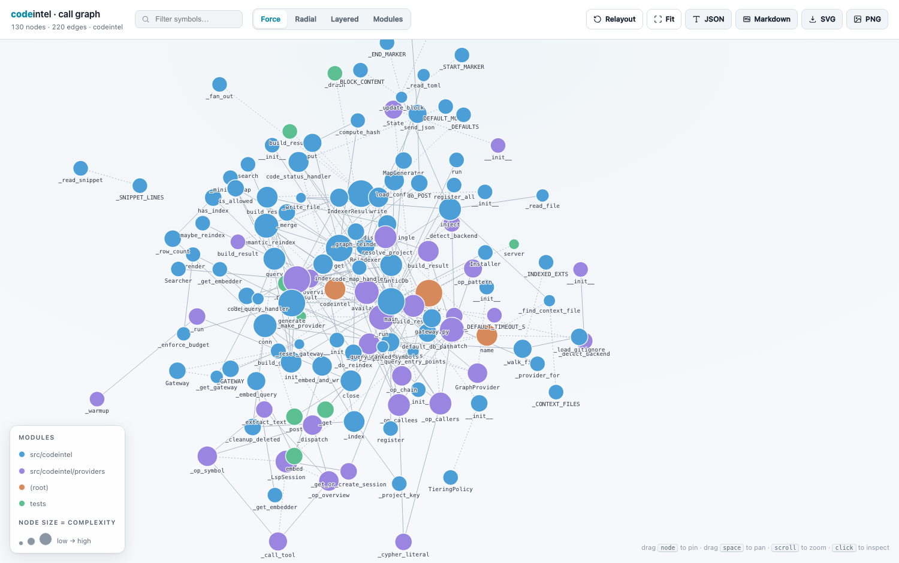
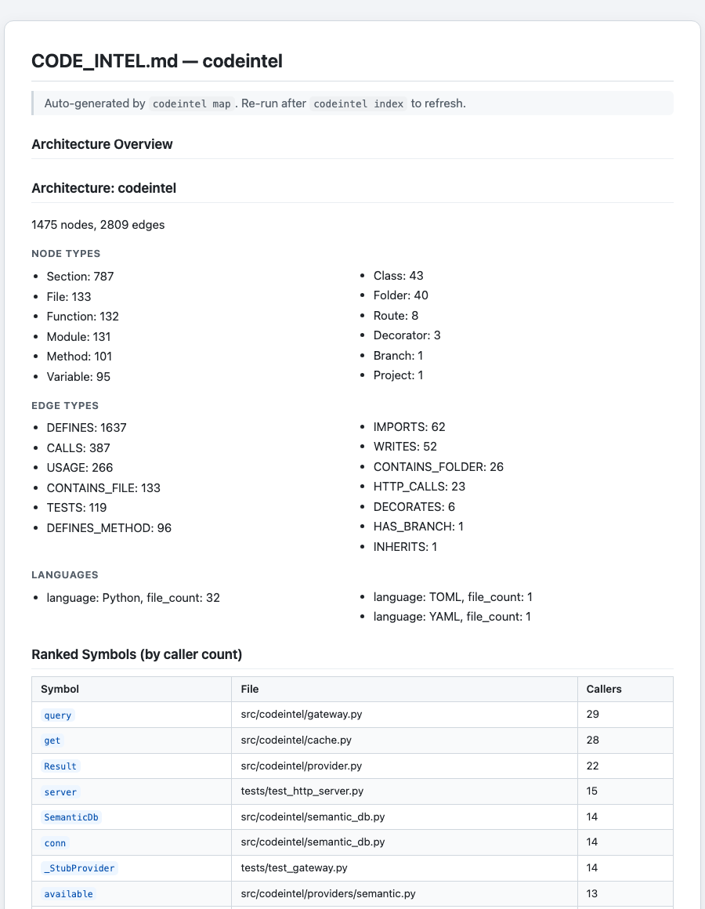
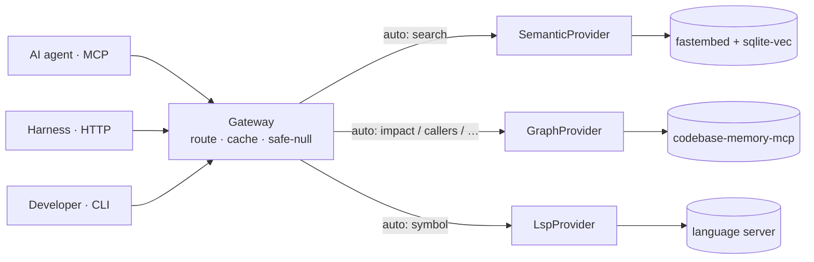

# codeintel

**One MCP tool that lets a coding agent search, trace, and *understand* a codebase — structurally, not by grepping.** codeintel unifies three engines — a call/import **graph**, an **LSP** for exact symbols, and **semantic** embedding search — behind a single `code.query` call that routes to the right engine, caches the answer, and **never throws**. The agent always gets back a clean, well-formed result to reason over.

[](https://github.com/hamilton-sky/codeintel/actions/workflows/ci.yml)
[](https://pypi.org/project/codecortex/)
[](https://pypi.org/project/codecortex/)
[](LICENSE)

> **Status: beta (`0.x`), and young.** The `code.query` surface is one call and has been stable
> since `0.8`, the suite is thorough, and every release is gated by a canary that runs a real query
> against a built wheel. But this is a new project with a single maintainer, and each time it has
> been pointed at an unfamiliar codebase it has found real bugs. **Use it locally, on a developer
> machine, for a single user** — that is the case it is built and tested for. Before relying on it
> for anything beyond that, read **[Project status](#project-status)**.



> *codeintel visualizing its own codebase.* One command — `codeintel graph <repo> --html` — turns any indexed repo into a **self-contained, interactive call graph** you can open offline or share as a file. Layouts, complexity-sized nodes, click-to-inspect metrics, and JSON/Markdown/SVG/PNG export. See **[docs/graph-viewer.md](docs/graph-viewer.md)**.

Prefer plain text? `codeintel map` writes a **readable architecture overview** to `CODE_INTEL.md` — node/edge counts, ranked symbols by caller count, and entry points — for skimming or for MCP hosts that can't render a graph:



**What `CODE_INTEL.md` is for.** It's a *static, committable* snapshot of a codebase's shape — meant to be read (by a person or an agent) **first**, instead of reconstructing structure by grepping. It covers the cases the live `code.query` tool doesn't:

- **Agents & hosts that don't speak MCP.** Not every agent supports MCP, and the server isn't always running. `codeintel map` writes a plain file any agent can read; `codeintel map --inject` also drops a short, tool-naming pointer block into `AGENTS.md` (the cross-tool surface read by Codex, Cursor, Zed, and others — created with your consent if it doesn't exist yet) plus a one-line `@AGENTS.md` import into `CLAUDE.md`, and writes the fuller [`USING_CODEINTEL.md`](USING_CODEINTEL.md) guide the block points to — so an agent knows to reach for `code.query` before it reaches for grep, not just that a `CODE_INTEL.md` exists.
- **A committed, diffable overview.** It lives *in the repo* — reviewable in a PR, browsable on GitHub, available offline. Re-run `codeintel map` after `codeintel index` to refresh it.
- **The load-bearing code at a glance.** Ranking symbols by caller count surfaces what most of the codebase depends on (the risky-to-change core) plus the entry points — the first things a newcomer, or an agent, should understand before touching anything.

See **[docs/map-file.md](docs/map-file.md)** for the format and the `--inject` flow.

## Why an agent needs it

Without structural tools, an agent dropped into unfamiliar code falls back on `grep` and reads whole files to reconstruct relationships by hand — burning tokens, missing call sites, and guessing at blast radius before it edits anything. codeintel answers those questions directly instead:

- **"What calls this? What breaks if I change it?"** → the real call graph, which catches cross-file and module-level callers a text search silently misses.
- **"Where is this symbol defined, and everywhere it's used?"** → the language server, with exact locations.
- **"Where's the code that does X?"** (when you don't know the name) → semantic search over the repo.
- **Always a clean answer.** Every call returns the same JSON envelope. A missing or broken backend degrades to a safe `null` *with a reason* — so the agent falls back to grep instead of crashing on an exception it can't reason its way out of.

Net effect: fewer, sharper tool calls, less re-reading, and an agent that can see *structure* — callers, impact, call chains — that plain search can't.

**The honest framing.** Agentic grep is still the backbone, and codeintel doesn't claim otherwise — Claude Code itself ships grep-only and that is a reasonable default for most of what an agent reads. The defensible claim is narrower: a structural index *where it pays*, degrading to grep the moment an engine is missing or not indexed, which is exactly what the safe-null contract above already does under the hood. Worth saying explicitly rather than leaving it implicit in a failure mode.

## What your agent can ask

It's one call: `code.query(op, target, engine="auto")`. In `auto` mode (the default) codeintel picks the engine per operation:

| Ask | `op` | Engine (auto) | Comes back as |
|---|---|---|---|
| Find code by meaning ("auth middleware") | `search` | semantic | ranked `path:line │ snippet` hits |
| A symbol's definition **and** all references | `symbol` | lsp | definition body + reference list |
| Who calls this? | `callers` | graph | caller symbols + files |
| What does this call? | `callees` | graph | callee symbols + files |
| Blast radius of a change | `impact` | graph | callers **and** callees together |
| Trace a call chain up/downstream | `chain` | graph | ordered, risk-labeled hops |
| Find symbols by pattern | `pattern` | graph | matching nodes + locations |
| Project shape at a glance | `overview` | graph → lsp | modules, node/edge counts, languages |
| Everything about one symbol | `context` | graph + lsp | both views merged |
| **Impact of your uncommitted edits** | `changed` | graph | changed files → impacted symbols |
| Refactor-risk hotspots | `hotspots` | graph | highest complexity / fan-in symbols |
| Unreferenced (dead) code | `deadcode` | graph | **withdrawn and now retired** — a labelled corpus measured its precision at 25%; safe-nulls with `reason: "op-withdrawn"`, and no flag brings it back — [the measurement, and what to use instead](#deadcode-is-retired) |

Pin one engine with `--engine graph│lsp│semantic`, or fan out with `--engine both` / `all` to merge results.

`callers`, `callees` and `impact` resolve the target by its **unqualified name**. When several
symbols share it, each matched symbol's rows are reported separately under its own heading and the
result says how many it found — narrow to one with a qualified target (`core.Group.invoke`) or a file
hint (`invoke@src/click/testing.py`); see
[when several symbols share a name](docs/graph.md#when-several-symbols-share-a-name).

#### `deadcode` is retired

`deadcode` no longer exists. Asking for it returns a safe-null (`reason: "op-withdrawn"`) with a hint
naming what to use instead, and **no flag brings it back** — the implementation has been deleted.

It was withdrawn pending one condition: *"it returns when a labelled corpus measures its precision
and recall — not before."* That corpus now exists, in
[`tests/test_corpus.py`](tests/test_corpus.py), and the measurement is what retired it.

**How it was measured.** Two pinned real Python repositories (`pallets/click`, `psf/requests`), with
every function and method collected from the **AST** — 2,425 definitions, `async def` and class
methods included, because a verification whose population comes from a pattern like `^\s*def ` cannot
see half of them. Each is labelled live or dead with the reference behind the label recorded beside
it. The oracle errs toward *live*: a decorator, a dunder, an override of an external interface, a
string-dispatch mention, or public-API status is each enough to call a symbol live, so "dead" is only
what survives all of them. That biases the numbers against the op, which is the correct direction for
a check whose output is an instruction to delete code. Known-answer canaries are planted in both trees
so recall has a denominator at all.

**The numbers.**

| | precision | recall |
|---|---|---|
| as shipped | **25%** (6 of 24) | 60% (6 of 10) |
| with the two repairs this codebase already contains elsewhere | 89% (8 of 9) | 80% (8 of 10) |

And the measurement that decided it — **real code only, canaries removed**: the op as shipped named
**18 candidates across those two repositories, and every one of them was live.** All 18 were Makefile
targets, which the graph backend indexes as `Function` nodes. Repaired, it names exactly one, and
that one is `MockRequest.get_type` in requests — a method `http.cookiejar` calls by duck-typed
convention, whose name appears once in the source.

**Why it was not repaired further.** The verification was a name-frequency scan over the source, so it
fails on exactly one condition: a symbol whose name appears once and is called by a convention
outside the source. Two repositories produced three distinct instances of that condition — non-code
nodes labelled `Function`, interpreter-called dunders, and stdlib duck-typed protocol methods — and
the earlier TypeScript evidence adds a rollup plugin hook and object-literal properties. The set is
not enumerable: no specification lists `get_type`. Every repository added revealed a new member of it.

Weighed against that: in 2,425 real definitions across two maintained repositories there was **not
one** dead private symbol to find. An op whose measured yield on real code is zero true positives has
no benefit to set against that error rate.

**Use `callers` on a specific symbol instead.** "Does anything call this?" is exactly the question
`deadcode` was trying to answer in bulk, and `callers` answers it accurately, one symbol at a time.

## What makes it good

- **Local-first and private.** One process on your machine — no cloud service, no API keys, no telemetry, no per-query network. Safe to point at a private repo, even with `--engine all`. (The one-time exception: `fastembed` downloads its embedding model once, then runs fully offline.)
- **It never throws.** Every call returns the same JSON envelope; a missing or broken backend degrades to `null` *with a reason*. No exceptions, no 500s, no malformed output for the agent to trip over — so you never wrap `code.query` in a `try`.
- **One tool, not three.** Register a single MCP server and it auto-routes each question to graph, LSP, or semantic — instead of wiring up three backends with three response shapes and three failure modes.
- **Degrades instead of breaking.** No graph backend installed? That engine returns `null` and the agent falls back to grep. The semantic engine needs nothing external, so codeintel is useful the moment it's installed and only gets sharper as you add backends.
- **Fast on repeat, and the cache never lies.** A content-hash cache returns instantly for unchanged code and self-invalidates when a background reindex advances the index, so you never read a cached answer for code that moved on. The cache is bounded (LRU), so a long-running server holds steady memory. (The *cache* is always consistent with the index; how current the index itself is depends on the engine — see [Keeping answers fresh](#keeping-answers-fresh).)
- **Concurrency-safe.** The HTTP transport handles requests on threads, so one slow query (an LSP session warming, a first-time index) can't block every other agent.
- **Honest about its own health.** `codeintel doctor` answers three separate questions per engine — *installed?* *runnable?* *is this repo indexed?* — with the single command to fix each gap, so "installed" is never mistaken for "working". And a readiness claim is one a query can actually honor: install a missing backend mid-session and the running server picks it up on the next call, rather than reporting the engine healthy while quietly routing around it until you restart the host.

## Quickstart

```bash
pip install codecortex
```

This installs the `codeintel` CLI; the **semantic** engine works out of the box. (On PyPI the
distribution is `codecortex` because `codeintel` was taken; the CLI and import stay `codeintel`.)

**One command prepares the rest and indexes your repo:**

```bash
codeintel setup --all /path/to/your/project
```

This installs `uv` (for the LSP engine), warms serena, downloads the embedding model, indexes the
repo, and prints a health report ending in a **Next:** list — exactly what's ready and the one
remaining step. It's idempotent, so re-running is safe. The **graph** engine (`codebase-memory-mcp`)
is an *optional* external binary that adds who-calls / impact / hotspots / `changed`; codeintel is
fully usable without it.

Or from source:

```bash
git clone https://github.com/hamilton-sky/codeintel.git
cd codeintel
pip install -e .
```

Register with your AI agent(s), then query:

```bash
codeintel install            # registers with the agents you actually have installed
codeintel query --op search --target "authentication middleware"
```

### Or: have your agent set it up

Prefer to let your coding agent run the steps? Generate a paste-ready prompt, tailored to this
machine and agent:

```bash
codeintel prompt                    # this repo — probes health, emits only the steps still outstanding
codeintel prompt --fresh | pbcopy   # the full sequence from `pip install`, to send a friend
```

It runs a `doctor` probe and prints a block you copy into Claude Code / Codex / Gemini / Zed: the
exact remaining commands (or "just restart me" when everything is already healthy and registered),
a `doctor --deep` verification, and the reminder to restart the agent so the MCP tools load. The
prompt goes to stdout (so `| pbcopy` grabs exactly it); the "paste this" note goes to stderr.

### Enable native Codex integration

`codeintel` is an MCP server, so Codex can call its tools directly rather than invoking the CLI.
After installing the package, explicitly register it with Codex:

```bash
codeintel install --agent codex
```

This safely adds a `[mcp_servers.codeintel]` entry to `~/.codex/config.toml` (or `$CODEX_HOME/config.toml`
when that is set) without changing your other Codex settings. Registration is deliberately opt-in:
installing a Python package should not silently modify an agent's configuration. Start a new Codex
task (or restart Codex) after registration; the refreshed task will have native `code.query`,
`code.status`, `code.doctor`, and `code.map` MCP tools available.

For a fully prepared local setup, run:

```bash
codeintel setup --all /path/to/your/project && codeintel install --agent codex
```

### Enable native Claude Code integration

After installing the package, explicitly register it with Claude Code:

```bash
codeintel install --agent claude
```

This adds the `codeintel` MCP server to `~/.claude.json` (or `$CLAUDE_CONFIG_DIR/.claude.json`)
while preserving your existing configuration — that is the file Claude Code reads for user-scope
MCP servers, and you can confirm the entry with `claude mcp list`. Start a new Claude Code session
after registration so it can load the native `code.query`, `code.status`, `code.doctor`, and
`code.map` MCP tools.

> **Upgrading from ≤ 0.11.1?** Earlier versions wrote this block to `~/.claude/settings.json`,
> which Claude Code ignores for MCP registration — so codeintel never actually loaded. Re-run
> `codeintel install --agent claude`; it registers in the right place and points out the stale
> entry so you can delete it.

For a fully prepared local setup, run:

```bash
codeintel setup --all /path/to/your/project && codeintel install --agent claude
```

### Registration is verified, not assumed

**It only touches agents you have.** `codeintel install` defaults to `--agent auto`: it registers
the hosts whose config root already exists on this machine and *names the ones it skipped*.
Installing a Python package should not create `~/.gemini/` and `~/.config/zed/` for someone who has
neither. Force a specific host with `--agent claude|codex|gemini|zed`, or every supported host with
`--agent all`.

**It registers an absolute path.** The bare name `codeintel` is resolved by the *host*, not by the
shell you ran `install` in — and a GUI-launched desktop agent does not source your shell profile, so
a command your terminal finds is routinely invisible to the app. That is the one failure a handshake
run in your terminal cannot catch, because it inherits the PATH that works. Pass
`--relative-command` for the bare name. If a later upgrade moves the binary, re-running
`codeintel install` repairs the stale path in place, leaving the rest of your config untouched.

Then it launches the exact command it registered and drives a real MCP handshake —
`initialize` → `tools/list` — and reports what came back:

```text
v claude: registered at /Users/you/.claude.json

v verified: codeintel 0.22.0 — 4 tools (code.query, code.status, code.doctor, code.map)
```

If the command is not on `PATH`, or the server fails to start, install says so and exits non-zero
instead of reporting a success your agent cannot use. Pass `--no-verify` to skip the handshake.

The same principle gates releases. Because every result is a safe envelope with `ok: true` and the
CLI never throws, an exit-code smoke test passes against a build that boots cleanly and answers
nothing — so **[`scripts/release_canary.py`](scripts/release_canary.py)** runs before every publish
against the built wheel in a clean environment: it registers Codex and Claude Code into a throwaway
`HOME`, launches the command those config files name, and asserts on the **answer text** of a real
`code.query` over a fixture repo. A release that writes a config no host reads, or that returns
`ok: true` with nothing in it, fails there instead of on your machine.

> Full reference — what each host reads, the absolute-path rationale, and troubleshooting:
> **[docs/install.md](docs/install.md)**.

## How it works

A `Gateway` receives every query and dispatches it to one of three providers — graph (structural relationships), LSP (precise symbol resolution), or semantic (embedding-based search) — based on the operation type. Each provider is fully isolated: if it is unavailable or raises an exception, the gateway catches it and returns a safe-null envelope. The caller always gets a well-formed response with no exception to catch.



> Full walkthrough: **[docs/architecture.md](docs/architecture.md)** · **[docs/query-flow.md](docs/query-flow.md)**.

## Safe-null contract

Every `Gateway.query()` call returns a dict with exactly these keys:

```json
{"ok": true, "op": "search", "target": "auth", "result": null, "engine": "semantic", "cached": false}
```

`ok` is always `true`. `result` is `null` when no provider has an answer — never an exception, never a 500. Callers must check `result is not None` before using the value.

The optional keys are the ones worth reading when an answer surprises you:

| Key | Meaning |
|---|---|
| `reason` | Why `result` is null — `engine-unavailable`, `no-result`, `not-in-graph` (the symbol isn't in the index — usually a stale index), `project-not-indexed`, `unsupported-op`, `root-not-allowed-for-role` (RBAC) |
| `hint` | The specific command that resolves this `reason`, when there is one |
| `engine` | Which engine actually answered — not necessarily the one you asked for, under `auto` |
| `cached` | Whether it came from the content-hash cache |
| `reindexing` | Present and `true` when a reindex was running, i.e. the answer reflects the last *completed* index. See [Keeping answers fresh](#keeping-answers-fresh) |

`codeintel query --json` prints this envelope from the CLI.

## Engines

| Engine | Key ops | Install prereq |
|---|---|---|
| `graph` | `impact`, `callers`, `callees`, `chain`, `pattern`, `overview`, `context` | `codebase-memory-mcp` **0.9.x** on PATH (`pip install 'codebase-memory-mcp==0.9.*'`) — 0.10.x changed its response format and returns nothing for every op but resolution; see [docs/graph.md](docs/graph.md) |
| `lsp` | `symbol`, `overview`, `context` | `uvx` on PATH — serena is fetched from GitHub on first use; see [docs/lsp.md](docs/lsp.md) |
| `semantic` | `search`, `context` | `fastembed` + `sqlite-vec` (installed with the package) — see [docs/semantic.md](docs/semantic.md) |

Run `codeintel doctor` at any time to see which engines are actually ready for a repo and how to fix the ones that aren't.

### Keeping answers fresh

The three engines have genuinely different freshness models, and it's worth knowing which you're
reading:

| Engine | Freshness |
|---|---|
| `lsp` | **Live.** Reads your files at query time — always current, no refresh needed. |
| `semantic` | **Incremental.** A background reindex re-embeds only what changed; `codeintel status` shows the index age. |
| `graph` | **Snapshot.** Built by `codeintel index` and stale until the next one. |

So a `callers`/`impact`/`hotspots` answer is only as current as your last index. If a result
describes code you just changed — or a symbol you just added comes back
`reason: "not-in-graph"` — that's the signal to re-run:

```bash
codeintel index /path/to/repo
```

The reply names the fix when it can: a missing symbol now returns a `hint` with the exact command
rather than a bare reason.

One more honest caveat. For targets that are **symbol names or free text** (most of them —
`callers`, `impact`, `hotspots`, `search`), there is no file whose content hash could change, so a
cached answer is invalidated only when a background reindex completes, and those are debounced
(~30s). An edit followed immediately by the same query can therefore return the pre-edit answer.
Targets that are real file paths are content-hashed and refresh as soon as the bytes change.

Pass `--engine auto` (the default) and codeintel chooses the best engine per operation. Pass `--engine both` or `--engine all` to fan out to multiple engines and merge results.

## Documentation

Full system docs live in [`docs/`](docs/) — start with the index:

- **[Architecture](docs/architecture.md)** — layers, the `CodeProvider` protocol, the safe-null contract, caching, freshness (ASCII + Mermaid).
- **[Install & registration](docs/install.md)** — what each agent host actually reads, why the registered command is an absolute path, and the three levels of proof that registration worked.
- **[Query flow](docs/query-flow.md)** — request lifecycle, engine selection, fan-out & merge, and why it never throws.
- **[Map file](docs/map-file.md)** — the static `CODE_INTEL.md` orientation layer for hosts with no MCP support.
- **[Benchmarks](docs/benchmarks.md)** — real numbers at scale: 25 k chunks indexed in ~8 min, ~235 ms warm queries, 60 MB index.
- Engine references: **[graph](docs/graph.md)** · **[lsp](docs/lsp.md)** · **[semantic](docs/semantic.md)**.

## CLI reference

| Command | Purpose |
|---|---|
| `codeintel help` | Every command grouped by task, with descriptions and examples (also the bare `codeintel`). A mistyped command suggests what you meant. |
| `codeintel install [--agent auto\|claude\|codex\|gemini\|zed\|all] [--no-verify] [--relative-command]` | Register codeintel with the agents installed on this machine (`auto`, the default), then prove it by completing a real MCP handshake against the registered command |
| `codeintel setup [project_root] [--all] [--index] [--warm] [--install-uv] [--install-deps] [--json]` | Prepare backends + index this repo (`--all` = one command: do everything automatable, idempotent); ends with a health report + **Next:** steps |
| `codeintel prompt [project_root] [--agent auto\|claude\|codex\|gemini\|zed] [--fresh] [--deep]` | Print a paste-to-your-agent setup prompt; probes health and emits only the outstanding steps (or "just restart me" when already healthy). `--fresh` = the full sequence from `pip install`, to send a friend |
| `codeintel index [project_root] [--quiet]` | Index a repo (semantic embeddings + best-effort graph & map refresh), with a live progress display; `--quiet` prints only the result line |
| `codeintel serve` | Start the MCP server (stdio transport) |
| `codeintel serve-http [--host HOST] [--port 8766] [--allow-remote] [--token TOKEN]` | Start the HTTP transport (loopback-only unless `--allow-remote`; `--token` requires a bearer token on every request) |
| `codeintel query --op OP --target TARGET [--engine auto] [--project-root DIR] [--json]` | Run a single query and print the result |
| `codeintel status [project_root]` | Show engine availability and index age |
| `codeintel doctor [project_root] [--deep] [--json]` | Diagnose per-engine health + repo index status, with a fix for each gap |
| `codeintel map [project_root]` | Generate the `CODE_INTEL.md` orientation file |
| `codeintel graph [project_root] [--html] [--out FILE] [--limit N]` | Emit the call graph as `{nodes,edges}` JSON, or `--html` a self-contained interactive viewer — see [docs/graph-viewer.md](docs/graph-viewer.md) |
| `codeintel c4 [project_root] [--out DIR] [--depth N] [--scope PATH] [--include-tests] [--no-index] [--json]` | Write a LikeC4 architecture model (`.c4`) of the repo's file/directory structure and its import graph — committable, diffable, hand-editable source rather than a rendered picture. Indexes the repo first if it has no graph index. See [docs/c4.md](docs/c4.md) |
| `codeintel reset [project_root] [--all] [--yes] [--json]` | Clear this repo's index — **both** semantic and graph — so it's as if never indexed; `--all` wipes every repo. Recovers from a corrupt/stale DB |
| `codeintel gen-token` | Print a secure random bearer token (for `serve-http` / RBAC `auth.toml`) |

Human-facing commands (`doctor`, `setup`, `prompt`, `reset`) honor `--no-color` / `NO_COLOR` and `--ascii`, and auto-degrade to plain text when piped.

**Exit codes**, so a `make` target or CI step can gate on `$?`:

| | |
|---|---|
| `0` | The command did its job. For `query` this includes an empty result — "nothing found" is an answer, not a failure. |
| `1` | The command could not do its job: a file it exists to write wasn't written (`map`, `graph`), an index didn't happen (`index`), a project root doesn't exist, or an engine is unhealthy (`doctor`, `setup`). |
| `2` | Bad usage — an unknown command or a missing required flag. |

## Config

Create `.codeintel.toml` at your project root to override defaults:

```toml
backend          = "auto"                   # auto | graph | lsp | semantic
semantic         = "on"                     # on | off
reindex          = "on-demand"              # on-demand | never
cosine_floor     = 0.25                     # minimum similarity score for semantic hits (0–1)
max_chunks       = 500                      # max chunks to embed per file
max_total_chunks = 100000                   # safety ceiling on chunks embedded in one index pass
model            = "BAAI/bge-small-en-v1.5" # fastembed embedding model
```

Config is **validated on load** — an out-of-range number, a misspelled enum, or a wrong type falls back to that key's default (with a logged warning) instead of breaking every query.

**Environment variables:**

| Variable | Effect |
|---|---|
| `CODEINTEL_HTTP_TOKEN` | Bearer token required by `serve-http` (equivalent to `--token`) |
| `CODEINTEL_AUTH_CONFIG` | Path to an RBAC token→role config (default `~/.codeintel/auth.toml`) — per-token roles + op scopes |
| `CODEINTEL_LOG_LEVEL` | `DEBUG`\|`INFO`\|`WARNING`(default)\|`ERROR` for the server logger |
| `CODEINTEL_LOG_FORMAT=json` | Structured (JSON-per-line) logs for ELK / Splunk / Datadog |
| `CODEINTEL_HTTP_ACCESS_LOG=1` | One log line per HTTP request (method, path, status, latency) |
| `CODEINTEL_DEBUG=1` | Log the full traceback of any error the never-throw contract swallows (silent by default) — the switch for diagnosing an unexpected `null` |
| `CODEINTEL_REINDEX=off` | Disable the background reindexer; queries then index inline to stay fresh |
| `CODEINTEL_HOME` | Where per-machine state lives (default `~/.codeintel`) — the index cache, the global `config.toml`, and `auth.toml`. Set this when the process has **no resolvable home directory** — a container running as a UID with no passwd entry and no `$HOME`, which is common when an agent runs in one. Without it, `Path.home()` raises and every command fails somewhere far from the cause. |

## Privacy & dependencies

**codeintel is local-first** — one local process, no cloud service, no API keys, no telemetry, and no per-query network. Its own code makes zero outbound HTTP calls, and the HTTP transport binds to `127.0.0.1` only by default — binding a non-loopback host requires `--allow-remote`, and `--token` (or `CODEINTEL_HTTP_TOKEN`) then gates every request behind a bearer token. The server bounds concurrent connections, but for exposure to a hostile network you should still front it with a reverse proxy (TLS, rate-limiting) — the built-in `http.server` is not hardened for the open internet.

**Bundled (installed with the package, run locally):** `mcp` (the tool interface) · `sqlite-vec` (the semantic index, a local DB file) · `fastembed` (the local embedding model).

**Optional external backends** — auto-detected on `PATH`; if one is absent, that engine returns a safe-null and the agent simply degrades to grep:

| Engine | Needs on `PATH` | Third-party? |
|---|---|---|
| `graph` | `codebase-memory-mcp` | yes — external CLI |
| `lsp` | `uvx` (fetches & runs serena from GitHub on first use) | yes — [oraios/serena](https://github.com/oraios/serena) |
| `semantic` | *nothing external* | no — fully in-house |

Not sure what's installed? `codeintel doctor` reports exactly which backends are present, whether this repo is indexed, and the command to fix each gap.

**The only network touch is first-run setup:** `fastembed` downloads the `BAAI/bge-small-en-v1.5`
weights once — cached under `fastembed`'s own default (`$TMPDIR/fastembed_cache`, **not**
`~/.cache`; override with `FASTEMBED_CACHE_PATH` for a location that survives a `/tmp` cleanup),
fully offline thereafter; the optional backends also install on first use *if you opt in*. After
that, **no code or data leaves your machine** — which is what makes `--engine all` safe to run on
a private repo. Behind a proxy or fully air-gapped, this download is the one step that can fail —
see [Offline / air-gapped install](docs/install.md#offline--air-gapped-install) for a documented
workaround.

**What codeintel writes to disk.** `~/.codeintel/semantic.db` is a **single file shared across
every repo you've ever indexed** with this machine's default embedding model (rows are
partitioned internally by repo) — 239 MB was observed here after indexing a handful of repos.
`codeintel reset <repo>` clears that repo's rows but does not shrink the file (SQLite doesn't
reclaim space without a `VACUUM`); `codeintel reset --all` removes the file outright. Separately,
the **LSP** engine's backend (serena) writes a `.serena/` directory *into each project you index*
— add it to that project's `.gitignore` (codeintel's own repo does).

## For agents

Register codeintel as an MCP server (`codeintel install`) and the agent gets four tools:

| MCP tool | HTTP equivalent | Purpose |
|---|---|---|
| `code.query` | `POST /code/query` | The main call — search, trace, understand (the `op` table above) |
| `code.status` | `GET /code/status` | Per-engine `installed` / `runnable` / `repo_indexed`, probed against the live engines a query actually hits |
| `code.doctor` | `POST /code/doctor` | Per-engine health + repo index status, with a fix for each gap |
| `code.map` | — | Generate/refresh `CODE_INTEL.md`, a static orientation file for hosts without MCP |

Over MCP the agent calls `code.query` directly. Over HTTP, start the server and POST to `/code/query`:

```bash
codeintel serve-http &   # listens on 127.0.0.1:8766 by default
```

For a shared or remote deployment, start it with `--allow-remote --token "$CODEINTEL_HTTP_TOKEN"` and send `Authorization: Bearer <token>` on each request — a missing or wrong token gets a clean `401`. Requests are handled concurrently, so one slow query never blocks another.

```python
import urllib.request, json

def code_query(op: str, target: str, engine: str = "auto") -> dict:
    body = json.dumps({"op": op, "target": target, "engine": engine}).encode()
    req = urllib.request.Request(
        "http://127.0.0.1:8766/code/query",
        data=body,
        headers={"Content-Type": "application/json"},
    )
    with urllib.request.urlopen(req) as resp:
        return json.loads(resp.read())

result = code_query("search", "authentication middleware")
if result["result"] is not None:
    print(result["result"])   # ranked semantic matches
```

The response is always JSON-safe. Check `result["result"] is not None` before use. Never catch an exception from the gateway — it never raises.

## Operations & deployment

Running codeintel as a shared service? It ships with what ops teams expect:

| Endpoint | Auth | Purpose |
|---|---|---|
| `GET /healthz` | none | Liveness — always `200` (for load balancers / `livenessProbe`) |
| `GET /readyz` | none | Readiness — `200` once the gateway is up (`readinessProbe`) |
| `GET /metrics` | token | Prometheus exposition — request counts, latency, in-flight, build info |

Plus **bearer-token auth** — or **RBAC** (per-token roles + op scopes via `auth.toml`; a disallowed op returns `403`, and the role is server-authoritative so a client can't escalate) — **structured JSON logs** (`CODEINTEL_LOG_FORMAT=json`) with optional per-request access logs, **graceful `SIGTERM`** shutdown, a bounded connection pool, and a non-root **Dockerfile** with a healthcheck.

**Full guide → [docs/deploy.md](docs/deploy.md)**: systemd, Docker / Compose, Kubernetes (liveness + readiness probes, token from a Secret), reverse-proxy TLS, **RBAC + SSO-via-auth-proxy**, a Prometheus scrape config, and a security checklist.

```bash
docker build -t codeintel . && docker run -p 127.0.0.1:8766:8766 \
  -e CODEINTEL_HTTP_TOKEN="$(openssl rand -hex 32)" codeintel
```

## Project status

An honest picture, so you can decide what to trust this with.

**What's solid.** The suite is large and real — more test code than source, a coverage floor
enforced in CI, and fault-injection tests behind the never-raise contract. CI runs lint, `mypy`,
and the full suite on Python 3.11/3.12/3.13, then builds the wheel, installs it into a clean
environment, and runs a **release canary** that registers the build with Codex and Claude Code in a
throwaway `HOME`, boots the server those configs name, and asserts on the answer text of a real
`code.query`. A release that installs into a file no host reads, or that boots and answers nothing,
fails before it ships. The `code.query` envelope has been stable since `0.8`.

**What's young.** The project is pre-1.0 and moves fast. The honest signal is in the
[CHANGELOG](CHANGELOG.md): `0.15.0` and `0.15.1` were written almost entirely from pointing the
tool at four repositories it had never seen, and several of those defects had survived multiple
adversarial review rounds. **The rate at which new codebases surface new bugs has not yet flattened.**
Expect to be the first person to hit something, and please report it — see below.

**Use it for.** Local, single-user code intelligence on a developer machine. That is the designed
case, it is the tested case, and the blast radius of a wrong answer is a wasted tool call: the
safe-null contract means a failing engine degrades to `null` with a reason, so your agent falls
back to grep rather than crashing.

**Be careful with.**

| Area | Why |
|---|---|
| `deadcode` | Withdrawn, then **retired** (`reason: "op-withdrawn"`) — a labelled corpus measured 25% precision. Use `callers` on a specific symbol instead — [the measurement](#deadcode-is-retired). |
| Non-loopback serving | `serve-http` is stdlib `http.server`. It binds loopback by default for a reason; front it with a reverse proxy and see [docs/deploy.md](docs/deploy.md). |
| RBAC between **untrusting** tenants | It separates privilege levels among callers you already trust. It is not a wall against an adversary with write access to their own root — see the warning in [docs/deploy.md](docs/deploy.md). |
| Unattended automation | Anything that acts on a result without a human reading it deserves a pilot first. |

**On the test numbers.** The suite is large and the coverage floor is enforced, but read the figure
with its caveat. In the **main test job** the graph and LSP backends are absent, so their live tests
skip and those engines run against hand-authored mocks rather than the real wire contract. Separate
jobs cover the contract itself: `graph-contract` installs the pinned `codebase-memory-mcp` and runs
the live graph tests — and **fails if they skipped**, because a silently-skipped contract test is
how a total backend outage stayed green here once — while the nightly corpus job runs that same
real backend against pinned third-party repositories. `lsp-contract` runs the live serena tests but
is **`continue-on-error`**: serena is fetched from an upstream git HEAD this project does not
control, so a breakage there must be visible without blocking an unrelated release. Read that as
the LSP wire contract being *watched* rather than *gated*. The release canary — the only check that
asserts on real answer text from a built wheel — still covers **the semantic engine only**.

Line coverage measures how much of the intended behavior runs, not how much of reality it has met.

**The honest one-paragraph version.** codeintel has been run on very few repositories its author did
not write, and that is where its bugs have come from — every fix in `0.15.x` came from pointing it
at an unfamiliar codebase. Its characteristic failure mode is **answering confidently from the
wrong index rather than failing loudly**, which the never-raise contract makes harder to notice: a
wrong answer and a right one are the same shape. Run `codeintel doctor` before trusting a repo-wide
answer — and `deadcode` in particular is retired rather than merely caveated (see above) — and if
something looks off please [report it](#reporting-a-problem) — an issue from someone who is not the
author is the single most useful thing this project can receive right now.

**Engine coverage depends on external binaries.** Semantic search works out of the box. The graph
engine needs `codebase-memory-mcp` and the LSP engine needs `uvx` on `PATH` — without them those
engines safe-null and you get a fraction of the capability table above. `codeintel setup --all`
installs what it can and `codeintel doctor` tells you exactly what is missing and how to fix it.
Run `doctor` first if the tool seems quieter than the docs suggest.

**The graph backend is the closest competitor, and it should be named as one.**
`codebase-memory-mcp` already ships semantic vector search, hybrid LSP type resolution, impact
analysis, and auto-registration with several agents on its own. A user who installs it alone gets
most of this project's capability table with less setup. The marginal value of codeintel over its
own backend is the unification, the safe-null contract, and the LSP merge — one call across three
engines instead of three separate tools to learn, a never-raise contract enforced by
fault-injection tests rather than convention, and answers that merge graph structure with exact
LSP locations instead of picking one. That's real and defensible, and considerably narrower than
"three engines" makes it sound.

**Maintenance.** One maintainer, MIT licensed, issues and PRs welcome. There is no support
guarantee — factor that into anything load-bearing.

## Reporting a problem

`codeintel doctor --json` prints a complete, machine-readable picture of what's installed, what's
runnable, and whether this repo is indexed — per engine, with the remediation for each gap. Paste
it into an issue and the report is actionable immediately instead of needing a round trip:

```bash
codeintel doctor --json
```

It reports only local engine and index state. Over the HTTP transport the `registrations` field —
which names agent config files on the machine running the server — is deliberately omitted.

If a *result* looks wrong rather than a command failing, send the envelope rather than the
rendered text:

```bash
codeintel query --op callers --target yourSymbol --json
```

`engine` says which engine answered, `cached` whether it came from the cache, `reindexing` whether
the index was mid-rebuild, and `reason`/`hint` why an empty answer was empty. Those five fields are
usually the whole diagnosis.

## Development

```bash
git clone https://github.com/hamilton-sky/codeintel.git
cd codeintel
pip install -e .[dev]

pytest tests/ -q            # ~740 tests, ~30s; fails under 83% coverage
ruff check src tests        # lint
mypy                        # types (src/ only)
```

**Your local run is not CI's run.** A dev machine usually has `codebase-memory-mcp` and `uvx`
installed; CI has neither, so the live graph/LSP tests skip there *and* the never-raise envelopes
take different `reason`/`hint` paths. A bug reachable only on the no-backend path passes at your
desk and fails in CI. To see CI's shape before you push:

```bash
env PATH="$(dirname "$(which python)"):/usr/bin:/bin" pytest -q
```

**Release gate.** The unit suite runs against the source tree, so it cannot see a packaging break, a
missing entry point, a host config written where nobody reads it, or a server that boots and answers
nothing. Run the canary against the built wheel in a clean environment — the same check CI runs
before publishing:

```bash
python -m build && python -m venv /tmp/canary && /tmp/canary/bin/python -m pip install dist/*.whl && /tmp/canary/bin/python scripts/release_canary.py
```

It exits non-zero on the first failed check and cleans up the temporary `HOME` it installs into.
