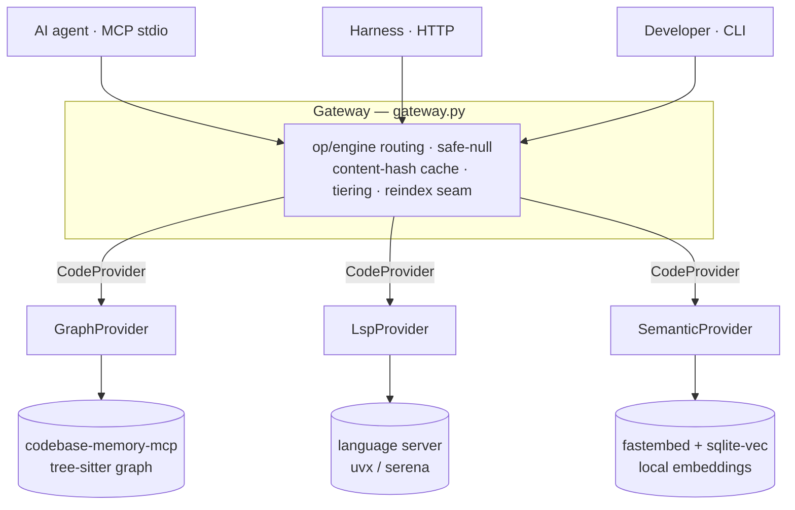
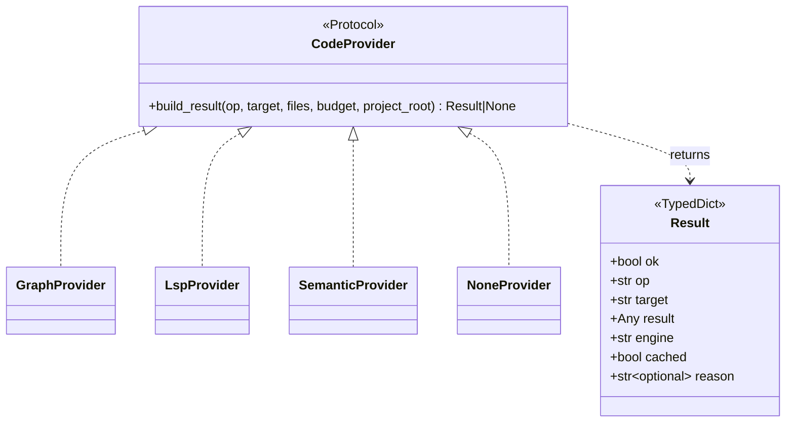
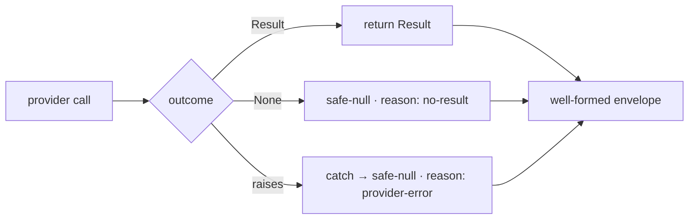

# Architecture

`codeintel` is a **layered, single-responsibility** system: three interchangeable engines sit
behind one protocol, one gateway unifies them, and three transports expose the gateway. Every
layer only ever *adds* information to a response — it can never break one (the [never-raise
contract](#safe-null-contract)).

## The big picture

```
                       ┌──────────────────────────────────┐
   agent   (MCP)  ────▶│  Gateway  (gateway.py)            │
   harness (HTTP) ────▶│   • op → engine routing           │
   human   (CLI)  ────▶│   • safe-null contract            │
                       │   • content-hash cache            │
                       │   • auto-detect + reindex seam    │
                       │   • optional role/op tiering      │
                       └───────────────┬──────────────────┘
                                       │  CodeProvider protocol
                 ┌─────────────────────┼─────────────────────┐
                 ▼                     ▼                     ▼
          GraphProvider          LspProvider          SemanticProvider
          (breadth)              (precision/fresh)    (meaning)
                 │                     │                     │
        codebase-memory-mcp     language server        fastembed +
        (tree-sitter graph)     (uvx / serena)         sqlite-vec  (in-house)
```



## Layers

| Layer | Files | Responsibility |
|---|---|---|
| **Transports** | `server.py` (MCP stdio), `http_server.py` (HTTP), `__main__.py` (CLI) | Accept a request, hand it to the gateway, return the envelope verbatim. |
| **Gateway** | `gateway.py`, `cache.py`, `policy.py`, `reindexer.py` | Route by op/engine, fan out & merge, cache, enforce the contract, fire background reindex. |
| **Protocol** | `provider.py` | The `CodeProvider` interface + the `Result` envelope + `safe_null_result`. |
| **Providers** | `providers/graph.py`, `lsp.py`, `semantic.py`, `none.py` | One adapter per engine; each **never raises**. |
| **Backends** | (external) + `indexer.py`, `semantic_db.py`, `searcher.py` | The actual intelligence — two wrapped, one in-house. |

## The CodeProvider protocol

Every engine implements the same one-method interface, so engines are swappable and composable
(`both`/`all` just fan out and merge). This is the seam that lets a wrapped backend be replaced by
an in-house one later **without changing the public contract**.



`build_result` returns a `Result` on success or `None` when it has nothing — **never an
exception**. The gateway turns `None` into a safe-null envelope.

## Safe-null contract

Every response is the same shape, and `ok` is always `true` at the tool boundary:

```json
{ "ok": true, "op": "search", "target": "auth", "result": null,
  "engine": "semantic", "cached": false, "reason": "no-result" }
```

- `result: null` never means "crash" — it means *found nothing* or *engine not installed*.
- `reason` distinguishes the two (`no-result` vs `engine-unavailable`, …).
- The invariant is **tested by fault injection**, not just convention (`tests/test_never_raise.py`).



## Content-hash cache

`cache.py` keys results by `(op, target, engine, project_root)`. A repeated query on an unchanged
file is served from cache (`cached: true`); an edit changes the content hash and forces a refresh.
This keeps hot paths cheap without ever serving stale results across an edit.

## Freshness / reindex seam

`reindexer.py` fires a **debounced, fire-and-forget** background reindex (semantic + graph) from a
query — it never blocks the response. Disabled with `CODEINTEL_REINDEX=off`. See
[query-flow.md](query-flow.md) for where it sits in the request path.

## Design principles

- **Never-raise everywhere** — a provider failure can only *subtract* an answer, never break a response.
- **Provider protocol** — engines are swappable; the public contract is independent of any backend.
- **Local-first & private** — no network egress in the default path; the semantic engine runs on a local model.
- **Single responsibility** — gateway / providers / index-store / transports / config are separate concerns, each a small file.

## Privacy & dependencies

codeintel is a **single local process** — no cloud service, no API keys, no telemetry, no per-query network. A source scan finds zero outbound HTTP clients or API-key usage in its own code; the HTTP transport binds to `127.0.0.1` only.

| Kind | What | Notes |
|---|---|---|
| Python libs (bundled) | `mcp`, `sqlite-vec`, `fastembed` | installed with the package; run locally |
| External backend — graph | `codebase-memory-mcp` (subprocess) | optional; auto-detected via `shutil.which` |
| External backend — lsp | `uvx` / `serena` (subprocess) | optional; auto-detected |
| External backend — semantic | *(none)* | fully in-house |

**Network:** the only egress is first-run downloads — `fastembed` fetches the `BAAI/bge-small-en-v1.5` model once (cached under `~/.cache`, offline thereafter), and the optional backends install on first use if you opt in. After setup, no code or data leaves the machine — which is what makes `both`/`all` fan-out safe to run on private repos.

## See also

- [query-flow.md](query-flow.md) — the request lifecycle, engine selection, fan-out, caching.
- [graph.md](graph.md) · [lsp.md](lsp.md) · [semantic.md](semantic.md) — per-engine references.
- [map-file.md](map-file.md) — the static `CODE_INTEL.md` orientation layer.
