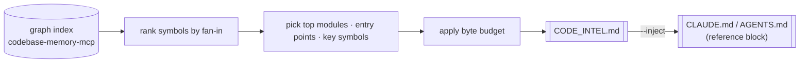

# Map file — `CODE_INTEL.md`

The **universal, zero-integration** layer. `codeintel map` generates a compressed, *ranked*
`CODE_INTEL.md` from the graph index — an architecture overview, top modules, key symbols (highest
fan-in), and entry points, under a byte budget. Any agent can read a file, so this works even for
hosts with **no MCP support**, and primes orientation with zero setup.

It *complements* the live `code.query` tool — the file is a static snapshot for orientation; the
tool answers fresh, arbitrary queries.

## Pipeline



1. **Read** the graph index for the project (`MapGenerator(GraphProvider)`).
2. **Rank** symbols by fan-in (most-called first) and roll up per module.
3. **Select** the highest-signal items — architecture summary, top modules, key symbols, entry points.
4. **Budget** — trim to fit `--budget` bytes (default `32768`) so the file stays cheap to read.
5. **Write** `CODE_INTEL.md` at the project root; optionally `--inject` a reference block into the
   repo's existing agent-context file (`CLAUDE.md` / `AGENTS.md`).

## Properties

- **Deterministic** on an unchanged repo; **updates** on change (refreshed on `index`).
- **Committable** — check it in so teammates and agents get oriented with zero setup.
- **Bounded** — never larger than the byte budget; truncation is by rank, so the highest-signal
  content survives.

## Usage

```bash
codeintel map                      # write ./CODE_INTEL.md for the current repo
codeintel map /path/to/repo        # for another repo
codeintel map --inject             # also link it into CLAUDE.md / AGENTS.md
codeintel map --budget 16384       # tighter size cap
```

MCP tool equivalent:

```jsonc
// tool: code.map
{ "project_root": "/path/to/repo", "budget": 32768, "inject": false }
// → { "ok": true, "path": ".../CODE_INTEL.md", "size_bytes": 12345, "inject": null }
```

If the graph engine is unavailable, `map` degrades safely (empty/partial map, `note: map-error`) —
like everything else, it never raises.

## See also

- [architecture.md](architecture.md) — where the map sits relative to the live gateway.
- [graph.md](graph.md) — the index the map is built from.
