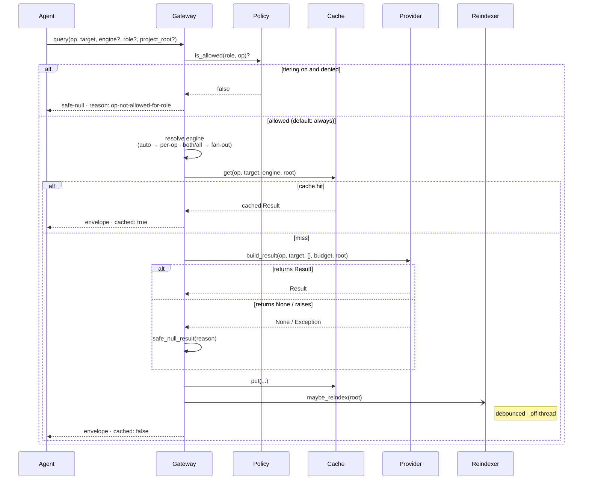
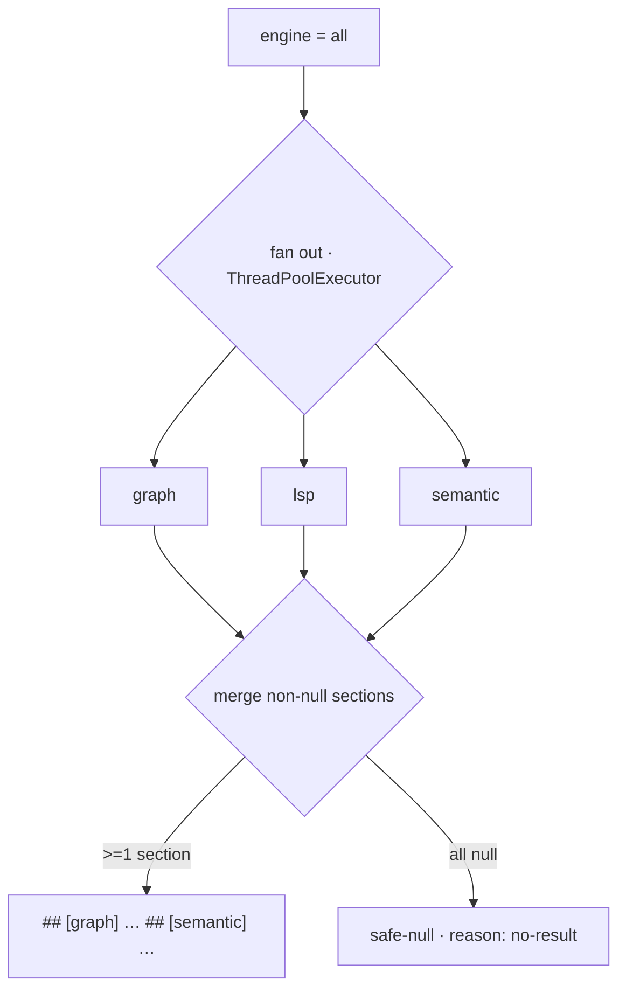
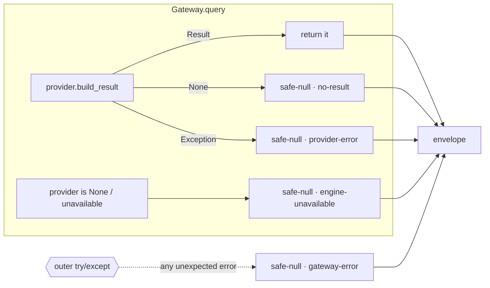

# Query flow

How a single `code.query` travels from an agent to an answer — and why it can never throw.

## The request lifecycle



## Step 1 — Engine selection

The gateway resolves the `engine` argument before dispatch:

```
engine = "auto"  (default)      →  pick ONE engine by op:
    ┌───────────────────────────────────────────────┐
    │ impact · callers · callees · chain             │
    │ pattern · overview · changed                   │
    │ changes · hotspots            ──────────►  graph   │
    │ symbol                        ──────────►  lsp     │
    │ search                        ──────────►  semantic│
    │ context                       ──────────►  both    │
    └───────────────────────────────────────────────┘

engine = "graph" | "lsp" | "semantic"   →  that engine only
engine = "both"                         →  graph + lsp        (fan out → merge)
engine = "all"                          →  graph + lsp + sem  (fan out → merge)
engine = <anything else>                →  safe-null · reason: unknown-engine
```

## Step 2 — Fan-out & merge (`both` / `all`)

Multi-engine requests dispatch concurrently and merge the non-null sections. One slow or missing
engine can't sink the others — its slot degrades to null and drops out of the merge.



## Step 3 — Cache

`(op, target, engine, project_root)` is the cache key. A hit returns immediately with
`cached: true`. Only the content hash of the target changes the key — so re-querying an unchanged
file is free, and editing it busts the entry on the next call.

## Step 4 — Background reindex (non-blocking)

After answering, the gateway *may* nudge the [`Reindexer`](architecture.md#freshness--reindex-seam)
for the project root. It is debounced and runs off-thread — the response has already been returned,
so freshness never costs latency. Turn it off with `CODEINTEL_REINDEX=off`.

**One pass per repository, across processes.** The debounce is per process, and you routinely have
more than one: an MCP server your agent launched, plus whatever you run in a terminal. Measured
2026-09-18, before this was fixed — two passes started together on a 600-file repo *each* embedded
all 600 chunks and each reported success, because both read the same "what is new" answer before
either had written anything. The entire embedding cost was paid twice, with the two passes
contending for the same cores.

A pass now takes an advisory `flock` on `<codeintel home>/locks/reindex-<slug>.lock` and skips
entirely if another process holds it. Losing that race is not an error and is not reported: the
holder is already doing exactly this work. The same lock makes `reindexing: true` visible **across**
processes, so a terminal query no longer says nothing is happening while the server rebuilds.

It is a `flock` rather than a "reindexing" flag file for one reason: the kernel releases it when the
process dies, however it dies. A flag file would survive a crash and leave the repository marked
"reindexing" forever — a signal true of a file and false of the world, which is the failure this
codebase catalogues. `tests/test_reindex_lock.py` proves the property against a real `SIGKILL`ed
holder rather than asserting it.

A locking failure never blocks indexing: without `fcntl` (Windows) or with an unwritable home, the
pass simply runs as it did before.

## Why it never throws

Every dispatch path is wrapped so the **only** outputs are a `Result` or a safe-null envelope:



The agent's contract is therefore simple: **check `result is not None`, never wrap the call in a
`try`.**

## See also

- [architecture.md](architecture.md) — layers, the provider protocol, the contract.
- Per-engine reason codes: [graph.md](graph.md) · [lsp.md](lsp.md) · [semantic.md](semantic.md).
